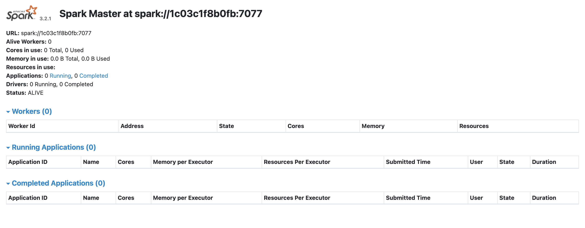
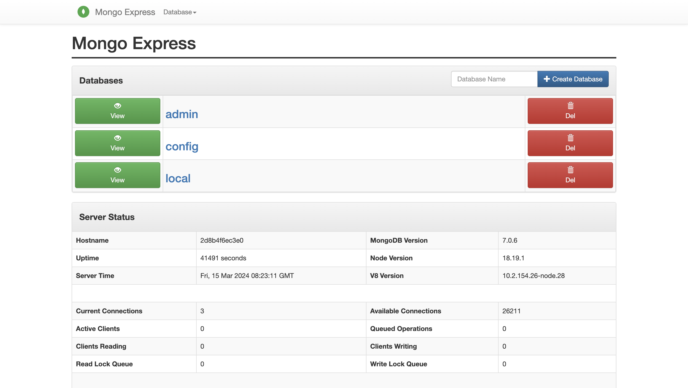

## DevOps Project 🧑‍💻

*Hugo Lhernould - Johannes Houenou - Axel Lanyan - Arouna Kanoke - Mehdi Mahoudi - Nicolas Speich*

### For deploy on AWS 👊🏼

#### 0 - Necessary dependency ✌️

 - Terraform CLI
 - AWS CLI

#### 1 - Configure your AWS credidentials 🚗

 - Log you on you AWS account
 - in `eu-west-3` region
 - Create **EC2 Key Pair** region and download them, put this at the root of directory
 - Configure Security group with rules like that: 

    `Custom TCP with PORT 8080`
    `Custom TCP with port 8081`
    `SSH with port 22 and your IP`

 - Configure your AWS CLI

#### 2 - Run Terraform 🏃‍♂️

 - In first, run `terraform init`
 - Secondary, run `terraform apply`
 - You have to enter the name of your key file
 - You have to enter the path of your key file 
**(THE FILE MUST BE IN ROOT FOLDER)**

 - Waiting for deployement

 ⚠️ *The region is eu-west-3 for the AMI image, don't chnage that*

#### 3 - How to access to app 🏠

 - **Spark App**
    - Go in your `MySparkInstance`
    - Get your **Public IPv4 DNS**
    - Access to `http://<SPARK-IP>:8080` and no `https` ⚠️

 - **Mongo UI App**
    - Go in your `MyMongoInstance`
    - Get your **Public IPv4 DNS**
    - Access to `http://<MONGO-IP>:8081` and no `https` ⚠️
    - User: `admin` and password: `password`

#### 4 - Result

 - **Spark App**

       

 - **Mongo UI App**

    
